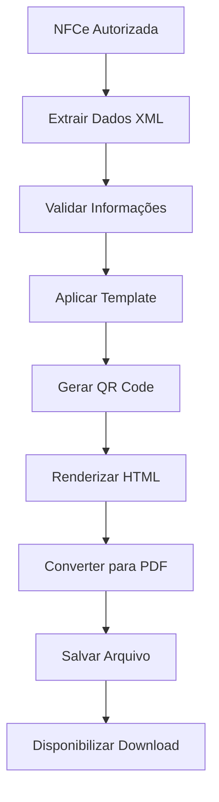

# Documentação DANFE - NFCeBox

Este documento descreve o processo de geração, layout e impressão do DANFE (Documento Auxiliar da Nota Fiscal Eletrônica de Consumidor) no sistema NFCeBox.

## 📋 Índice

1. [O que é DANFE](#-o-que-é-danfe)
2. [Estrutura do DANFE](#-estrutura-do-danfe)
3. [Processo de Geração](#-processo-de-geração)
4. [Layout e Formatação](#-layout-e-formatação)
5. [Configuração de Impressão](#-configuração-de-impressão)
6. [Troubleshooting](#-troubleshooting)
7. [Exemplos Práticos](#-exemplos-práticos)

## 📄 O que é DANFE

### Definição
O DANFE (Documento Auxiliar da Nota Fiscal Eletrônica de Consumidor) é a representação gráfica simplificada da NFCe, utilizada para acompanhar o transporte das mercadorias e facilitar a consulta da NFCe pelo consumidor.

### Características
- **Formato:** A4 ou bobina (cupom fiscal)
- **Conteúdo:** Resumo das informações da NFCe
- **Finalidade:** Comprovante para o consumidor
- **Obrigatoriedade:** Deve ser entregue ao consumidor

### Diferenças NFCe vs NFe
| Aspecto | NFCe | NFe |
|---------|------|-----|
| **Formato DANFE** | Cupom fiscal (bobina) | A4 (retrato) |
| **Tamanho** | Compacto | Detalhado |
| **Destinatário** | Consumidor final | Pessoa jurídica |
| **Complexidade** | Simplificado | Completo |

## 🏗️ Estrutura do DANFE

### Seções Obrigatórias

#### 1. Cabeçalho
```
┌─────────────────────────────────────────┐
│              EMPRESA LTDA               │
│         CNPJ: 12.345.678/0001-90       │
│    Rua das Flores, 123 - Centro        │
│         São Paulo - SP - 01234-567     │
│                                         │
│           CUPOM FISCAL ELETRÔNICO       │
│              NFCe nº 000123             │
│         Série: 001  Emissão: 15/01/2024│
└─────────────────────────────────────────┘
```

#### 2. Dados do Destinatário (se identificado)
```
┌─────────────────────────────────────────┐
│ CONSUMIDOR:                             │
│ João da Silva                           │
│ CPF: 123.456.789-00                    │
└─────────────────────────────────────────┘
```

#### 3. Itens da Venda
```
┌─────────────────────────────────────────┐
│ ITEM  DESCRIÇÃO           QTD  VL.UNIT  │
│ 001   Produto A           1,00   10,00  │
│ 002   Produto B           2,00   15,00  │
│                                         │
│ TOTAL DE ITENS: 2                       │
└─────────────────────────────────────────┘
```

#### 4. Totais e Impostos
```
┌─────────────────────────────────────────┐
│ SUBTOTAL:                    R$ 40,00   │
│ DESCONTO:                    R$  0,00   │
│ TOTAL:                       R$ 40,00   │
│                                         │
│ FORMA DE PAGAMENTO:                     │
│ Dinheiro                     R$ 40,00   │
└─────────────────────────────────────────┘
```

#### 5. Informações Fiscais
```
┌─────────────────────────────────────────┐
│ Chave de Acesso:                        │
│ 3524011234567890001234567890123456789012│
│                                         │
│ Consulte pela Chave de Acesso em:       │
│ www.nfce.fazenda.sp.gov.br              │
│                                         │
│ [QR CODE]                               │
└─────────────────────────────────────────┘
```

#### 6. Rodapé
```
┌─────────────────────────────────────────┐
│ Protocolo de Autorização:               │
│ 135240112345678900123456789012345678901 │
│ Data/Hora: 15/01/2024 10:30:45          │
│                                         │
│ Tributos Totais Incidentes (Lei Federal │
│ nº 12.741/2012): R$ 8,50               │
└─────────────────────────────────────────┘
```

## ⚙️ Processo de Geração

### Fluxo de Geração



### Implementação no NFCeBox

#### 1. Service de Geração
```php
<?php
// app/Services/DanfeService.php

class DanfeService
{
    public function generateDanfe(Sale $sale): string
    {
        // 1. Validar NFCe autorizada
        if (!$sale->nfce_authorized) {
            throw new Exception('NFCe não autorizada');
        }

        // 2. Extrair dados do XML
        $xmlData = $this->extractXmlData($sale->nfce_xml);
        
        // 3. Gerar QR Code
        $qrCode = $this->generateQrCode($xmlData);
        
        // 4. Renderizar template
        $html = view('danfe.template', [
            'sale' => $sale,
            'xmlData' => $xmlData,
            'qrCode' => $qrCode
        ])->render();
        
        // 5. Converter para PDF
        $pdf = PDF::loadHTML($html)
            ->setPaper('a4', 'portrait')
            ->setOptions([
                'dpi' => 150,
                'defaultFont' => 'sans-serif'
            ]);
            
        return $pdf->output();
    }
}
```

#### 2. Controller de Download
```php
<?php
// app/Http/Controllers/DanfeController.php

class DanfeController extends Controller
{
    public function download(Sale $sale)
    {
        $this->authorize('view', $sale);
        
        try {
            $pdf = app(DanfeService::class)->generateDanfe($sale);
            
            return response($pdf)
                ->header('Content-Type', 'application/pdf')
                ->header('Content-Disposition', 
                    'attachment; filename="danfe-' . $sale->id . '.pdf"');
                    
        } catch (Exception $e) {
            return back()->with('error', 'Erro ao gerar DANFE: ' . $e->getMessage());
        }
    }
}
```

## 🎨 Layout e Formatação

### Template HTML/CSS

#### Estrutura Base
```html
<!DOCTYPE html>
<html>
<head>
    <meta charset="UTF-8">
    <title>DANFE - NFCe {{ $sale->id }}</title>
    <style>
        @page {
            margin: 10mm;
            size: A4 portrait;
        }
        
        body {
            font-family: 'DejaVu Sans', sans-serif;
            font-size: 10px;
            line-height: 1.2;
            margin: 0;
            padding: 0;
        }
        
        .header {
            text-align: center;
            border: 1px solid #000;
            padding: 5px;
            margin-bottom: 5px;
        }
        
        .company-name {
            font-size: 14px;
            font-weight: bold;
            margin-bottom: 3px;
        }
        
        .items-table {
            width: 100%;
            border-collapse: collapse;
            margin: 5px 0;
        }
        
        .items-table th,
        .items-table td {
            border: 1px solid #000;
            padding: 3px;
            text-align: left;
        }
        
        .items-table th {
            background-color: #f0f0f0;
            font-weight: bold;
        }
        
        .totals {
            text-align: right;
            margin: 10px 0;
        }
        
        .qr-code {
            text-align: center;
            margin: 10px 0;
        }
        
        .footer {
            font-size: 8px;
            text-align: center;
            margin-top: 10px;
            border-top: 1px solid #000;
            padding-top: 5px;
        }
    </style>
</head>
<body>
    <!-- Conteúdo do DANFE -->
</body>
</html>
```

#### Seção de Cabeçalho
```html
<div class="header">
    <div class="company-name">{{ $sale->company->name }}</div>
    <div>CNPJ: {{ $sale->company->formatted_cnpj }}</div>
    <div>{{ $sale->company->full_address }}</div>
    <br>
    <div><strong>CUPOM FISCAL ELETRÔNICO</strong></div>
    <div>NFCe nº {{ $xmlData['numero'] }}</div>
    <div>Série: {{ $xmlData['serie'] }} | Emissão: {{ $sale->created_at->format('d/m/Y H:i:s') }}</div>
</div>
```

#### Tabela de Itens
```html
<table class="items-table">
    <thead>
        <tr>
            <th>Item</th>
            <th>Descrição</th>
            <th>Qtd</th>
            <th>Vl. Unit</th>
            <th>Total</th>
        </tr>
    </thead>
    <tbody>
        @foreach($sale->items as $index => $item)
        <tr>
            <td>{{ str_pad($index + 1, 3, '0', STR_PAD_LEFT) }}</td>
            <td>{{ $item->product->name }}</td>
            <td>{{ number_format($item->quantity, 2, ',', '.') }}</td>
            <td>R$ {{ number_format($item->unit_price, 2, ',', '.') }}</td>
            <td>R$ {{ number_format($item->total_price, 2, ',', '.') }}</td>
        </tr>
        @endforeach
    </tbody>
</table>
```

### QR Code

#### Geração do QR Code
```php
public function generateQrCode(array $xmlData): string
{
    // URL de consulta da SEFAZ
    $consultUrl = config('nfce.sefaz_consult_url');
    
    // Parâmetros do QR Code
    $params = [
        'chNFe' => $xmlData['chave_acesso'],
        'nVersao' => '100',
        'tpAmb' => config('nfce.environment') === 'producao' ? '1' : '2',
        'cDest' => $xmlData['cpf_cnpj_destinatario'] ?? '',
        'dhEmi' => $xmlData['data_emissao'],
        'vNF' => $xmlData['valor_total'],
        'vICMS' => $xmlData['valor_icms'],
        'digVal' => $xmlData['digest_value'],
        'cIdToken' => config('nfce.id_token'),
        'cHashQRCode' => ''
    ];
    
    // Gerar hash do QR Code
    $params['cHashQRCode'] = $this->generateQrCodeHash($params);
    
    // Montar URL completa
    $qrCodeUrl = $consultUrl . '?' . http_build_query($params);
    
    // Gerar QR Code como imagem base64
    return QrCode::format('png')
        ->size(150)
        ->generate($qrCodeUrl);
}
```

## 🖨️ Configuração de Impressão

### Formatos Suportados

#### 1. A4 (Padrão)
- **Tamanho:** 210 x 297 mm
- **Orientação:** Retrato
- **Margens:** 10mm em todos os lados
- **DPI:** 150 (recomendado)

#### 2. Cupom Fiscal (Bobina)
- **Largura:** 80mm
- **Altura:** Variável
- **Orientação:** Retrato
- **Margens:** 2mm laterais

### Configuração no Sistema

#### Arquivo de Configuração
```php
<?php
// config/danfe.php

return [
    'format' => env('DANFE_FORMAT', 'a4'), // a4 ou cupom
    'orientation' => env('DANFE_ORIENTATION', 'portrait'),
    'margins' => [
        'top' => env('DANFE_MARGIN_TOP', 10),
        'right' => env('DANFE_MARGIN_RIGHT', 10),
        'bottom' => env('DANFE_MARGIN_BOTTOM', 10),
        'left' => env('DANFE_MARGIN_LEFT', 10),
    ],
    'dpi' => env('DANFE_DPI', 150),
    'font' => [
        'family' => env('DANFE_FONT_FAMILY', 'DejaVu Sans'),
        'size' => env('DANFE_FONT_SIZE', 10),
    ],
    'logo' => [
        'enabled' => env('DANFE_LOGO_ENABLED', false),
        'path' => env('DANFE_LOGO_PATH', 'images/logo.png'),
        'width' => env('DANFE_LOGO_WIDTH', 100),
        'height' => env('DANFE_LOGO_HEIGHT', 50),
    ],
];
```

#### Variáveis de Ambiente
```env
# Configurações do DANFE
DANFE_FORMAT=a4
DANFE_ORIENTATION=portrait
DANFE_MARGIN_TOP=10
DANFE_MARGIN_RIGHT=10
DANFE_MARGIN_BOTTOM=10
DANFE_MARGIN_LEFT=10
DANFE_DPI=150
DANFE_FONT_FAMILY="DejaVu Sans"
DANFE_FONT_SIZE=10

# Logo da empresa (opcional)
DANFE_LOGO_ENABLED=false
DANFE_LOGO_PATH=images/logo.png
DANFE_LOGO_WIDTH=100
DANFE_LOGO_HEIGHT=50
```

### Impressão Automática

#### JavaScript para Impressão
```javascript
// resources/js/danfe-print.js

class DanfePrinter {
    static printDanfe(saleId) {
        // Abrir DANFE em nova janela
        const printWindow = window.open(
            `/sales/${saleId}/danfe?print=1`,
            'danfe-print',
            'width=800,height=600,scrollbars=yes'
        );
        
        // Aguardar carregamento e imprimir
        printWindow.onload = function() {
            setTimeout(() => {
                printWindow.print();
                printWindow.close();
            }, 1000);
        };
    }
    
    static downloadDanfe(saleId) {
        // Download direto do PDF
        window.location.href = `/sales/${saleId}/danfe/download`;
    }
}

// Uso nos botões
document.addEventListener('DOMContentLoaded', function() {
    // Botão de impressão
    document.querySelectorAll('.btn-print-danfe').forEach(button => {
        button.addEventListener('click', function() {
            const saleId = this.dataset.saleId;
            DanfePrinter.printDanfe(saleId);
        });
    });
    
    // Botão de download
    document.querySelectorAll('.btn-download-danfe').forEach(button => {
        button.addEventListener('click', function() {
            const saleId = this.dataset.saleId;
            DanfePrinter.downloadDanfe(saleId);
        });
    });
});
```

## 🔧 Troubleshooting

### Problemas Comuns

#### 1. DANFE não é gerado
**Sintomas:**
- Erro 500 ao tentar gerar
- Página em branco
- Timeout na geração

**Possíveis Causas:**
- NFCe não autorizada
- XML inválido ou corrompido
- Falta de memória PHP
- Biblioteca PDF não instalada

**Soluções:**
```bash
# Verificar status da NFCe
php artisan tinker
>>> $sale = Sale::find(123);
>>> dd($sale->nfce_authorized, $sale->nfce_xml);

# Aumentar limite de memória
# php.ini
memory_limit = 256M
max_execution_time = 60

# Instalar dependências
composer require barryvdh/laravel-dompdf
composer require simplesoftwareio/simple-qrcode
```

#### 2. Layout quebrado
**Sintomas:**
- Elementos sobrepostos
- Texto cortado
- Formatação incorreta

**Soluções:**
```css
/* Ajustar CSS do template */
@page {
    margin: 10mm;
    size: A4 portrait;
}

body {
    font-family: 'DejaVu Sans', sans-serif;
    font-size: 10px;
    line-height: 1.2;
}

/* Evitar quebra de página em elementos */
.no-break {
    page-break-inside: avoid;
}
```

#### 3. QR Code não funciona
**Sintomas:**
- QR Code não aparece
- Erro ao escanear
- Link inválido

**Verificações:**
```php
// Verificar configuração
dd(config('nfce.sefaz_consult_url'));
dd(config('nfce.id_token'));

// Testar geração manual
$qrCode = QrCode::format('png')->size(150)->generate('https://www.google.com');
echo '';
```

#### 4. Fontes não carregam
**Sintomas:**
- Texto com fonte padrão
- Caracteres especiais não aparecem

**Soluções:**
```php
// Instalar fontes no servidor
sudo apt-get install fonts-dejavu-core

// Ou usar fontes web-safe
body {
    font-family: Arial, Helvetica, sans-serif;
}
```

### Logs de Debug

#### Habilitar Logs Detalhados
```php
// app/Services/DanfeService.php

use Illuminate\Support\Facades\Log;

public function generateDanfe(Sale $sale): string
{
    Log::info('Iniciando geração DANFE', ['sale_id' => $sale->id]);
    
    try {
        // Processo de geração...
        Log::info('DANFE gerado com sucesso', ['sale_id' => $sale->id]);
        
    } catch (Exception $e) {
        Log::error('Erro na geração DANFE', [
            'sale_id' => $sale->id,
            'error' => $e->getMessage(),
            'trace' => $e->getTraceAsString()
        ]);
        throw $e;
    }
}
```

## 📋 Exemplos Práticos

### Exemplo 1: DANFE Simples

#### Dados da Venda
```json
{
  "id": 123,
  "customer": {
    "name": "João da Silva",
    "document": "123.456.789-00"
  },
  "items": [
    {
      "product": "Produto A",
      "quantity": 1,
      "unit_price": 10.00,
      "total_price": 10.00
    }
  ],
  "total": 10.00,
  "payment_method": "Dinheiro"
}
```

#### DANFE Resultante
```
┌─────────────────────────────────────────┐
│              EMPRESA LTDA               │
│         CNPJ: 12.345.678/0001-90       │
│    Rua das Flores, 123 - Centro        │
│         São Paulo - SP - 01234-567     │
│                                         │
│           CUPOM FISCAL ELETRÔNICO       │
│              NFCe nº 000123             │
│         Série: 001  Emissão: 15/01/2024│
├─────────────────────────────────────────┤
│ CONSUMIDOR:                             │
│ João da Silva                           │
│ CPF: 123.456.789-00                    │
├─────────────────────────────────────────┤
│ ITEM  DESCRIÇÃO           QTD  VL.UNIT  │
│ 001   Produto A           1,00   10,00  │
│                                         │
│ TOTAL DE ITENS: 1                       │
├─────────────────────────────────────────┤
│ SUBTOTAL:                    R$ 10,00   │
│ TOTAL:                       R$ 10,00   │
│                                         │
│ FORMA DE PAGAMENTO:                     │
│ Dinheiro                     R$ 10,00   │
├─────────────────────────────────────────┤
│ Chave de Acesso:                        │
│ 3524011234567890001234567890123456789012│
│                                         │
│ [QR CODE]                               │
│                                         │
│ Consulte em: www.nfce.fazenda.sp.gov.br│
└─────────────────────────────────────────┘
```

### Exemplo 2: Integração com Frontend

#### Blade Template
```html
<!-- resources/views/sales/show.blade.php -->

<div class="card">
    <div class="card-header">
        <h5>Venda #{{ $sale->id }}</h5>
    </div>
    <div class="card-body">
        <!-- Detalhes da venda -->
        
        <div class="mt-3">
            @if($sale->nfce_authorized)
                <button type="button" 
                        class="btn btn-primary btn-print-danfe"
                        data-sale-id="{{ $sale->id }}">
                    <i class="fas fa-print"></i> Imprimir DANFE
                </button>
                
                <button type="button" 
                        class="btn btn-secondary btn-download-danfe"
                        data-sale-id="{{ $sale->id }}">
                    <i class="fas fa-download"></i> Download DANFE
                </button>
            @else
                <span class="text-muted">
                    <i class="fas fa-exclamation-triangle"></i>
                    DANFE disponível após autorização da NFCe
                </span>
            @endif
        </div>
    </div>
</div>
```

### Exemplo 3: Comando Artisan para Regenerar DANFEs

```php
<?php
// app/Console/Commands/RegenerateDanfeCommand.php

use Illuminate\Console\Command;
use App\Models\Sale;
use App\Services\DanfeService;

class RegenerateDanfeCommand extends Command
{
    protected $signature = 'danfe:regenerate {sale_id?} {--all}';
    protected $description = 'Regenerar DANFE de vendas';
    
    public function handle(DanfeService $danfeService)
    {
        if ($this->option('all')) {
            $sales = Sale::whereNotNull('nfce_xml')->get();
            $this->info("Regenerando DANFE de {$sales->count()} vendas...");
            
            foreach ($sales as $sale) {
                try {
                    $danfeService->generateDanfe($sale);
                    $this->line("✓ Venda {$sale->id}");
                } catch (Exception $e) {
                    $this->error("✗ Venda {$sale->id}: {$e->getMessage()}");
                }
            }
        } else {
            $saleId = $this->argument('sale_id');
            $sale = Sale::findOrFail($saleId);
            
            try {
                $danfeService->generateDanfe($sale);
                $this->info("DANFE da venda {$saleId} regenerado com sucesso!");
            } catch (Exception $e) {
                $this->error("Erro: {$e->getMessage()}");
            }
        }
    }
}
```

## 📚 Referências

### Documentação Oficial
- [Manual de Orientação NFCe - SEFAZ](https://www.nfce.fazenda.gov.br/)
- [Layout do DANFE NFCe](https://www.nfce.fazenda.gov.br/danfe)
- [Especificações Técnicas QR Code](https://www.nfce.fazenda.gov.br/qrcode)

### Bibliotecas Utilizadas
- [Laravel DomPDF](https://github.com/barryvdh/laravel-dompdf)
- [Simple QrCode](https://github.com/SimpleSoftwareIO/simple-qrcode)
- [Laravel Snappy](https://github.com/barryvdh/laravel-snappy) (alternativa)

### Ferramentas de Teste
- [Validador NFCe SEFAZ](https://www.nfce.fazenda.gov.br/validador)
- [Consulta NFCe](https://www.nfce.fazenda.gov.br/consulta)
- [QR Code Reader Online](https://webqr.com/)