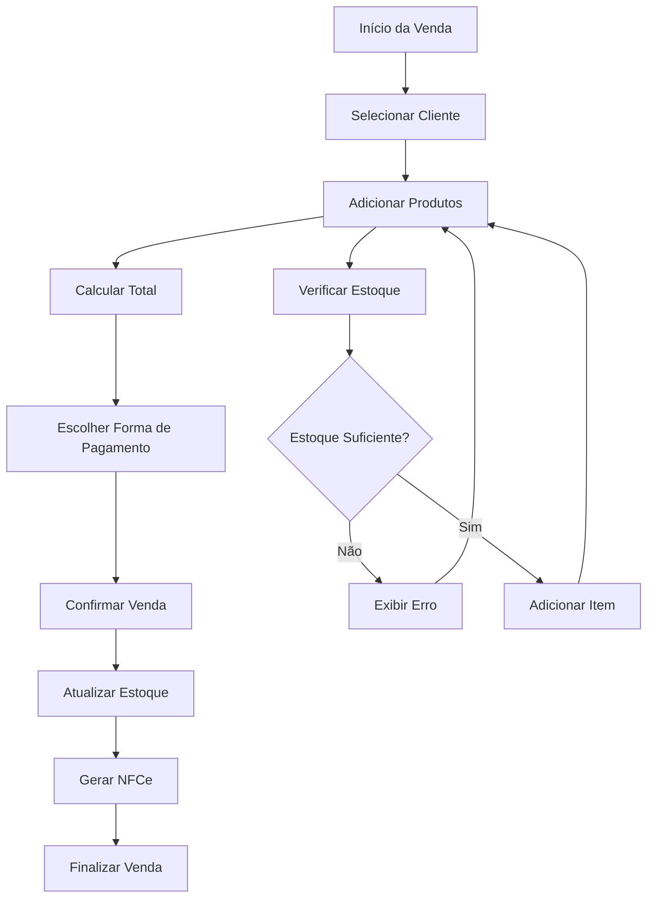
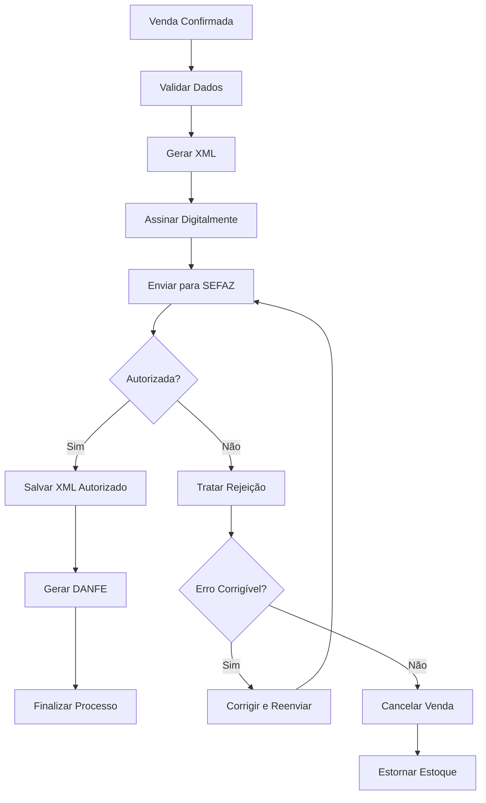
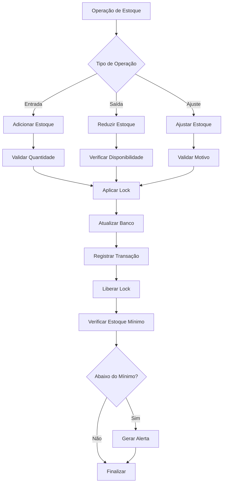
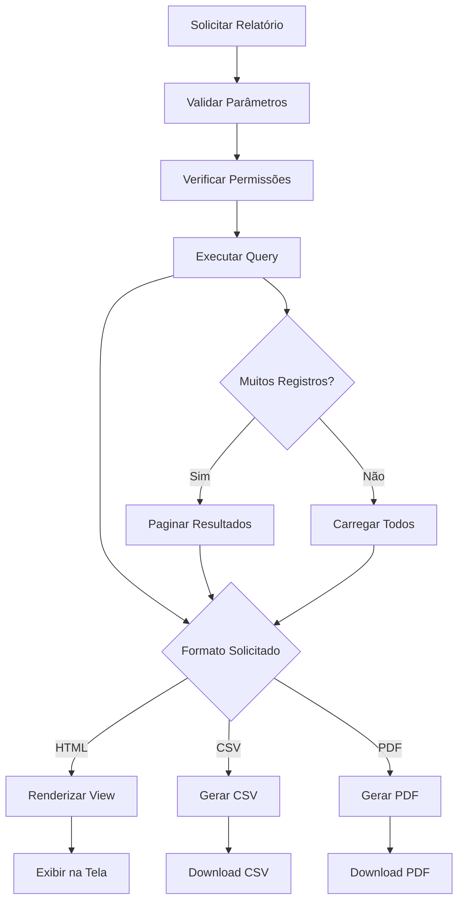
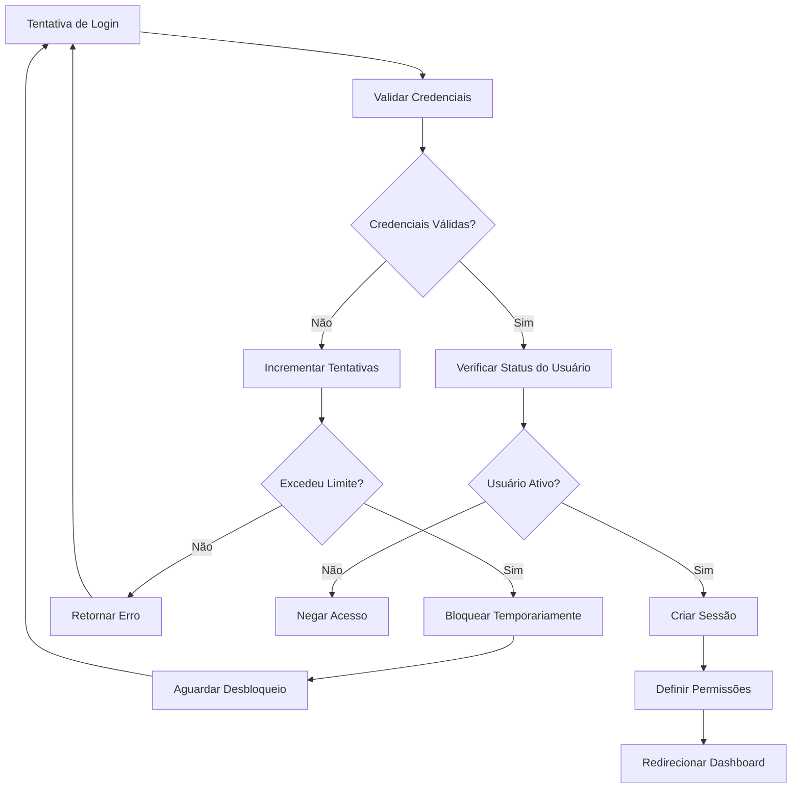
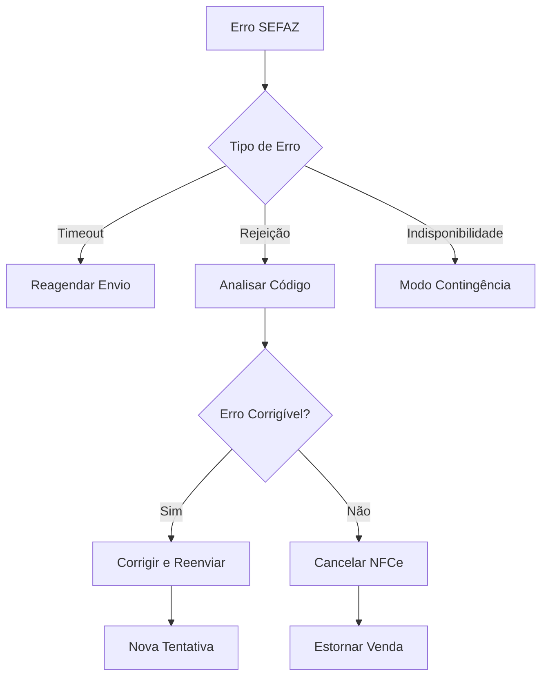

# Fluxos do Sistema NFCeBox

Este documento descreve os principais fluxos de negócio do sistema NFCeBox, incluindo processos de vendas, emissão de NFCe, gestão de estoque e relatórios.

## 📋 Índice

1. [Fluxo de Vendas](#-fluxo-de-vendas)
2. [Fluxo de Emissão de NFCe](#-fluxo-de-emissão-de-nfce)
3. [Fluxo de Gestão de Estoque](#-fluxo-de-gestão-de-estoque)
4. [Fluxo de Relatórios](#-fluxo-de-relatórios)
5. [Fluxo de Autenticação](#-fluxo-de-autenticação)
6. [Fluxos de Exceção](#-fluxos-de-exceção)

## 🛒 Fluxo de Vendas

### Processo Principal



### Detalhamento do Fluxo

#### 1. Início da Venda
- **Ator:** Usuário autenticado
- **Ação:** Acessa a tela de nova venda
- **Sistema:** Carrega formulário de venda
- **Validação:** Verifica permissões do usuário

#### 2. Seleção do Cliente
- **Opções:**
  - Cliente existente (busca por nome, CPF/CNPJ)
  - Novo cliente (cadastro rápido)
  - Consumidor final (sem identificação)
- **Validação:** CPF/CNPJ válido se informado

#### 3. Adição de Produtos
- **Busca:** Por código, nome ou código de barras
- **Validações:**
  - Produto ativo
  - Estoque disponível
  - Quantidade válida (> 0)
- **Cálculos:** Subtotal por item

#### 4. Cálculo do Total
- **Componentes:**
  - Subtotal dos itens
  - Descontos (se aplicável)
  - Impostos (ICMS, PIS, COFINS)
- **Atualização:** Automática a cada alteração

#### 5. Forma de Pagamento
- **Opções disponíveis:**
  - Dinheiro
  - Cartão de Débito
  - Cartão de Crédito
  - PIX
  - Boleto
- **Validação:** Valor do pagamento = Total da venda

#### 6. Confirmação e Finalização
- **Transação:** Atomicidade garantida
- **Operações simultâneas:**
  - Criação do registro de venda
  - Baixa no estoque (com lock)
  - Geração da NFCe
  - Atualização de métricas

## 📄 Fluxo de Emissão de NFCe

### Processo de Emissão



### Detalhamento do Processo

#### 1. Validação de Dados
- **Dados da Empresa:**
  - CNPJ válido
  - Inscrição Estadual
  - Certificado digital válido
- **Dados da Venda:**
  - Produtos com NCM
  - Valores corretos
  - Cliente (se identificado)

#### 2. Geração do XML
- **Estrutura:** Conforme layout da SEFAZ
- **Componentes:**
  - Identificação da NFCe
  - Dados do emitente
  - Dados do destinatário
  - Produtos/serviços
  - Totais e impostos
  - Forma de pagamento

#### 3. Assinatura Digital
- **Certificado:** A1 ou A3
- **Algoritmo:** SHA-256 com RSA
- **Validação:** Certificado válido e não expirado

#### 4. Comunicação com SEFAZ
- **Protocolo:** SOAP/HTTPS
- **Timeout:** Configurável (padrão 30s)
- **Retry:** Até 3 tentativas com delay

#### 5. Tratamento de Retorno
- **Autorizada:** Salva XML e gera DANFE
- **Rejeitada:** Analisa código de erro
- **Timeout:** Consulta status posteriormente

## 📦 Fluxo de Gestão de Estoque

### Controle de Estoque



### Tipos de Transações de Estoque

#### 1. Entrada de Estoque
- **Origem:** Compras, devoluções, ajustes
- **Validações:**
  - Quantidade > 0
  - Produto ativo
  - Usuário autorizado
- **Registro:** Histórico de movimentação

#### 2. Saída de Estoque
- **Origem:** Vendas, perdas, ajustes
- **Validações:**
  - Estoque suficiente
  - Quantidade > 0
  - Transação atômica
- **Lock:** Pessimistic lock durante operação

#### 3. Controle de Concorrência
- **Problema:** Race conditions em vendas simultâneas
- **Solução:** Database locks e transações
- **Implementação:**
  ```sql
  SELECT * FROM products WHERE id = ? FOR UPDATE;
  UPDATE products SET stock = stock - ? WHERE id = ?;
  ```

## 📊 Fluxo de Relatórios

### Geração de Relatórios



### Tipos de Relatórios

#### 1. Relatório de Vendas
- **Filtros:**
  - Período (data início/fim)
  - Cliente específico
  - Forma de pagamento
  - Status da venda
- **Dados:**
  - Lista de vendas
  - Totais por período
  - Gráficos de tendência

#### 2. Relatório de Produtos
- **Filtros:**
  - Categoria
  - Estoque baixo
  - Mais vendidos
- **Dados:**
  - Lista de produtos
  - Quantidade em estoque
  - Valor total do estoque

#### 3. Performance e Otimização
- **Paginação:** Máximo 1000 registros por página
- **Cache:** Resultados frequentes em cache
- **Índices:** Otimização de queries

## 🔐 Fluxo de Autenticação

### Login e Autorização



### Controle de Permissões

#### Níveis de Acesso
1. **Administrador:** Acesso total
2. **Gerente:** Vendas, relatórios, produtos
3. **Operador:** Apenas vendas
4. **Visualizador:** Apenas consultas

#### Middleware de Autorização
- **Verificação:** A cada requisição
- **Políticas:** Por recurso (Product, Sale, etc.)
- **Fallback:** Negação por padrão

## ⚠️ Fluxos de Exceção

### Tratamento de Erros

#### 1. Falha na Comunicação com SEFAZ


#### 2. Falha no Sistema de Pagamento
- **Detecção:** Timeout ou erro na transação
- **Ação:** Reverter operações realizadas
- **Notificação:** Alertar usuário e administrador

#### 3. Inconsistência de Estoque
- **Detecção:** Validação periódica
- **Correção:** Ajuste manual com auditoria
- **Prevenção:** Locks e transações atômicas

### Logs e Auditoria

#### Eventos Registrados
- **Vendas:** Criação, alteração, cancelamento
- **Estoque:** Todas as movimentações
- **NFCe:** Envios, autorizações, rejeições
- **Usuários:** Login, logout, alterações

#### Estrutura do Log
```json
{
  "timestamp": "2024-01-15T10:30:00Z",
  "user_id": 1,
  "action": "sale.created",
  "resource_id": 123,
  "details": {
    "customer_id": 45,
    "total": 150.00,
    "payment_method": "credit_card"
  },
  "ip_address": "192.168.1.100",
  "user_agent": "Mozilla/5.0..."
}
```

## 🔄 Processos em Background

### Jobs Assíncronos

#### 1. Processamento de NFCe
- **Trigger:** Venda finalizada
- **Processo:** Geração e envio assíncrono
- **Retry:** Até 3 tentativas
- **Fallback:** Notificação de falha

#### 2. Geração de Relatórios
- **Trigger:** Solicitação de relatório grande
- **Processo:** Geração em background
- **Notificação:** Email quando concluído

#### 3. Limpeza de Dados
- **Frequência:** Diária (via cron)
- **Ações:**
  - Limpar logs antigos
  - Remover sessões expiradas
  - Arquivar vendas antigas

### Monitoramento

#### Health Checks
- **Banco de dados:** Conectividade e performance
- **SEFAZ:** Disponibilidade do serviço
- **Certificados:** Validade e expiração
- **Espaço em disco:** Logs e arquivos

#### Alertas
- **Estoque baixo:** Produtos abaixo do mínimo
- **Certificado:** Próximo ao vencimento
- **Erros:** Taxa alta de falhas
- **Performance:** Tempo de resposta elevado

## 📱 Integração com Dispositivos

### Leitores de Código de Barras
- **Protocolo:** USB HID ou Serial
- **Integração:** JavaScript no frontend
- **Fallback:** Digitação manual

### Impressoras de DANFE
- **Formatos:** PDF para impressão
- **Configuração:** Impressora padrão do sistema
- **Alternativa:** Download do PDF

## 🚀 Performance e Escalabilidade

### Otimizações Implementadas

#### 1. Banco de Dados
- **Índices:** Em campos de busca frequente
- **Particionamento:** Tabelas de log por data
- **Connection Pool:** Reutilização de conexões

#### 2. Cache
- **Configurações:** Cache de configurações da empresa
- **Produtos:** Lista de produtos ativos
- **Relatórios:** Resultados de consultas frequentes

#### 3. Frontend
- **Lazy Loading:** Carregamento sob demanda
- **Minificação:** CSS e JavaScript otimizados
- **CDN:** Assets estáticos (se configurado)

### Limites e Capacidade

- **Usuários simultâneos:** Até 50 (recomendado)
- **Produtos:** Sem limite prático
- **Vendas por dia:** Até 10.000
- **Tamanho do banco:** Monitorar crescimento

## 📚 Referências Técnicas

- [Manual de Integração NFCe - SEFAZ](https://www.nfce.fazenda.gov.br/)
- [Documentação Laravel - Queues](https://laravel.com/docs/queues)
- [Padrões de Concorrência - Database Locking](https://laravel.com/docs/database#pessimistic-locking)
- [Boas Práticas - Logs e Auditoria](https://laravel.com/docs/logging)